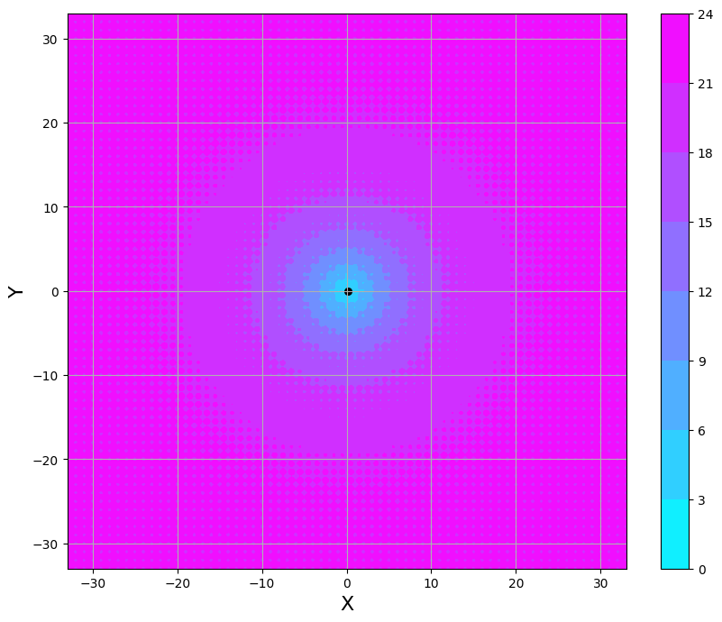

In the rich theatre of Nature, few creatures exemplify the power of evolutionary optimization as strikingly as the hummingbird. Similarly, in the field of artificial intelligence, Genetic Algorithms stand among the select few that have successfully harnessed the principles of evolution for optimization. In this post, I will discuss these techniques that solve complex problems through an evolutionary process, leading to optimal or near-optimal solutions.

<!--more-->

## GENETIC ALGORITHMS

Few creatures exemplify the power of evolutionary optimization as strikingly as the hummingbird. With its astonishing ability to hover in place and dart with unparalleled agility, this little bird serves as a living testament to the power of natural selection in fine-tuning species for specific ecological niches. Much like this remarkable creature, Genetic Algorithms (GA) stand as a testament to the ingenuity of artificial intelligence. These algorithms, part of the broader field of evolutionary computing, harness the principles of natural evolution to find optimal or near-optimal solutions to complex problems. Just as the hummingbird has evolved to become a master of aerodynamic efficiency, Genetic Algorithms evolve candidate solutions to arrive at the best possible answer, making them invaluable tools in various sectors from engineering to data science.

### Some biological context related to GA

Genetic algorithms, a subset of the field of evolutionary computing in artificial intelligence, draw their inspiration from Darwin's theory of evolution to find the most fit solutions to complex problems. The concept of evolutionary computing itself dates back to the 1960s, initiated by Rechenberg's work on 'Evolution Strategies.' It was further advanced by John Holland, who not only conceptualized Genetic Algorithms but also enriched the domain through his seminal book 'Adaption in Natural and Artificial Systems' published in 1975. Adding another layer to this, John Koza in 1992 employed genetic algorithms to evolve LISP programs for specific tasks, coining the term 'genetic programming' for his approach.

As a nature-inspired procedure, Genetic Algorithms (GA) are fundamentally built upon key biological concepts. For instance, every living organism is composed of cells, each containing a uniform set of chromosomes. These chromosomes, essentially strings of DNA, act as blueprints for the entire organism. They consist of individual genes ---blocks of DNA--- that encode specific proteins. In simpler terms, each gene governs a particular trait, such as eye color, with various possible configurations for that trait, known as alleles. Each gene occupies a designated position on the chromosome, referred to as its locus. The full structure of an organism's genetic material is called its genome, and a specific set of genes within that genome constitutes its genotype. This genotype, influenced by developments after birth, lays the foundation for the organism's phenotype, shaping both its physical and mental attributes.

Evolution chiefly involves generational changes, making reproduction another cornerstone in the understanding of GA. During natural reproduction, a process known as recombination or crossover occurs first, wherein genes from both parents merge to create a new chromosome, thus forming a new individual. This offspring may then undergo mutations, which are slight alterations in DNA elements, primarily induced by errors during the gene-copying process.

Lastly, an organism's fitness is gauged by its ability to survive and thrive throughout its lifetime, which -in the contexto of an optimization problems- means that the "fitness" of a particular solution is measured by how well it satisfies the set criteria or objectives of the problem at hand.

### The essence of human-like optimization

When we talk about optimization, whether in business decisions or algorithmic computations, the ultimate aim is to enhance performance. As Goldberg (1989) explains:

> *What are we trying to accomplish when we optimize? Optimization seeks to improve performance toward some optimal point or points. Note that this definition has two parts: 1) we seek improvement to approach some 2) optimal point. There is a clear distinction between the process of improvement and the destination or optimum itself. Yet, in judging optimization procedures, we commonly focus solely upon convergence (does the method reach the optimum?) and forget entirely about interim performance.*

These ideas are particularly crucial in Genetic Algorithms where we deal with complex search spaces comprising of all feasible solutions to a problem. Each solution can be represented as a point in this space and evaluated based on its 'fitness' or suitability to the problem at hand. Traditional perspectives on optimization often focus narrowly on convergence while overlooking the importance of intermediate performance levels. This inclination likely finds its roots in the calculus-based origins of optimization theories. However, such a viewpoint doesn't fit naturally with complex systems or real-world decision-making scenarios, such as in business. Here, the emphasis isn't necessarily on achieving a singular 'best' outcome but rather on making quality decisions within available resources. Success is often relative to competition and context, aiming for a 'satisficing' level of performance (Simon, 1969).

Applying this more nuanced understanding of optimization to Genetic Algorithms means recognizing that the journey toward the optimal is as significant as the destination itself. Within the search space, GA operates by generating new potential solutions as evolution progresses, each with its own fitness value. The optimization process thus becomes dynamic, continuously updating as new points are discovered in the search space. In complex systems, the goal isn't merely to locate an extreme value (minimum or maximum) but to progressively improve, even if reaching the 'perfect' optimum may be elusive.

In sum, when using Genetic Algorithms for optimization, the objective extends beyond mere convergence to an optimal point. The focus is also on the quality of interim solutions, which is essential for handling complex systems where 'good enough' often suffices. It's not merely about finding the best solution but about consistently striving for better ones."

### Search for solutions

In genetic algorithms, the search for a solution is carried on through an evolutionary process that begins with a collection of individuals, commonly referred to as a 'population'. Each individual in this population is represented by its own unique chromosome, which is essentially an encoded set of attributes. Initially, this population is often generated randomly, representing a diverse range of potential solutions to the problem at hand.

Members of one population are selected to create a new generation, guided by the aspiration that this new set of individuals will outperform the preceding ones. To achieve this aim, individuals are selected based on their 'fitness'---a measure of their suitability for solving the given problem. The higher their fitness, the greater their chance of being chosen to produce offspring. To quantify this fitness, we employ a fitness function (also known as an evaluation function) that takes an individual as input and returns a scalar value. This numerical output enables us to compare the fitness levels of different individuals within the population.

This evolutionary cycle continues until a certain condition is met, such as reaching a predetermined number of generations or achieving a sufficient improvement in the best solution.

**Procedure**

1.  **\[Start\]** Generate a random population of `n` chromosomes (suitable solutions for the problem)
2.  **\[Fitness\]** Evaluate the fitness `f(x)` of each chromosome `x` in the population
3.  **\[New Population\]** Create a new population by repeating the following steps until the new population is complete:
    1.  **\[Selection\]** Select two parent chromosomes from a population according to their fitness (the better the fitness, the bigger the chance to be selected).
    2.  **\[Crossover\]** With a crossover probability, cross over the parents to form new offspring (children). If no crossover was performed, the offspring is an exact copy of the parents.
    3.  **\[Mutation\]** With a mutation probability, mutate new offspring at each locus (position in chromosome).
    4.  **\[Accepting\]** Place new offspring in the new population.
4.  **\[Replace\]** Use the new generated population for a further run of the algorithm.
5.  **\[Test\]** If the end condition is satisfied, stop, and return the best solution in the current population.
6.  **\[Loop\]** Go to step 2.

### Encoding of a Chromosome

A chromosome encapsulates the information of the solution it represents. The most common form of encoding is a binary string. For instance:

-   **Chromosome 1**: `1101100100110110`
-   **Chromosome 2**: `1101111000011110`

In this binary encoding, each bit could signify certain characteristics of the solution. Alternatively, the entire string could represent a numerical value, an approach often employed in basic GA implementations. However, encoding can vary depending on the problem at hand. For example, one could use integer or real numbers, or even encode permutations.

### Crossover

Once the encoding method is chosen, the next step is the crossover operation. Crossover blends genes from parent chromosomes to produce new offspring. The simplest method involves picking a random crossover point and merging parts of the two parent chromosomes. Here's a quick illustration (where `|` indicates the crossover point):

-   **Chromosome 1**: `11011 | 00100110110`
-   **Chromosome 2**: `11010 | 11000011110`
-   **Offspring 1**: `11011 | 11000011110`
-   **Offspring 2**: `11010 | 00100110110`

Multiple crossover points can also be utilized, and the complexity of the crossover operation is often dictated by the type of encoding used.

The crossover probability dictates the frequency of crossover operations. If crossover is bypassed, the offspring become exact replicas of their parents. On the other hand, if crossover is performed, the offspring inherit traits from both parents' chromosomes.

-   **100% Crossover Probability**: All offspring are created through crossover.
-   **0% Crossover Probability**: The new generation is produced using exact copies of the chromosomes from the previous generation. Note that this doesn't necessarily mean the new generation will be identical to the old one.

The objective of crossover is to combine the advantageous traits from each parent, thereby generating improved offspring. However, it's often beneficial to allow a portion of the older population to continue into the next generation.

### Mutation

Following crossover, mutation comes into play. The purpose of mutation is to avoid convergence of the entire population to a local optimum. It involves making random changes to the offspring generated by the crossover. In the case of binary encoding, this could mean flipping random bits from 1 to 0 or vice versa. For example:

-   **Original Offspring 1**: `1101111000011110`
-   **Original Offspring 2**: `1101100100110110`
-   **Mutated Offspring 1**: `1100111000011110`
-   **Mutated Offspring 2**: `1101101100110110`

Like crossover, the specific technique used for mutation largely depends on the chosen encoding method. For instance, if permutations are being encoded, mutation could be executed by swapping two genes.

Mutation probability determines how frequently mutations will occur within a chromosome. In the absence of mutation, the offspring are produced either directly following crossover or as direct copies, with no changes applied.

-   **100% Mutation Probability**: The entire chromosome undergoes mutation.
-   **0% Mutation Probability**: No changes occur within the chromosome.

Mutation serves as a mechanism to prevent the genetic algorithm from converging to local optima. However, excessive mutation is counterproductive, as the algorithm may essentially devolve into a random search.

### Selection

As outlined early, chromosomes are selected from the population to serve as parents for the crossover operation. The challenge lies in deciding which chromosomes to select. Darwin's theory of evolution suggests that the fittest individuals are more likely to survive and produce offspring. There are several methods for selecting these "fit" chromosomes, such as roulette wheel selection, Boltzmann selection, tournament selection, rank selection, steady-state selection, and others. This sections will describe some of these methods.

**Roulette Wheel Selection**

In this method, parents are selected based on their fitness levels. The fitter the chromosome, the higher the chance it has of being selected. Imagine a roulette wheel where each section is proportional to the fitness value of a chromosome. A marble is rolled on this wheel, and the chromosome where it stops is selected. Essentially, chromosomes with higher fitness values have larger sections and are more likely to be chosen.

Here's how the algorithm works:

1.  **\[Sum\]** Calculate the sum `( S )` of all chromosome fitnesses in the population.
2.  **\[Select\]** Generate a random number `( r )` from the interval `( (0, S) )`.
3.  **\[Loop\]** Iterate through the population, summing fitnesses from 0 to `( s )`. Stop and return the chromosome when `( s > r )`.

**Rank Selection**

Roulette wheel selection may become problematic when there are large disparities in fitness values. In such cases, rank selection can be more appropriate. In this method, chromosomes are first ranked. Each chromosome then receives a fitness score based on this ranking, from 1 (least fit) to ( N ) (most fit), where ( N ) is the number of chromosomes in the population.

**Steady-State Selection**

This isn't a specific method of selecting parents, but rather an approach to population management. In this model, a large portion of the existing chromosomes can survive to the next generation. The basic idea is to select a few good chromosomes for creating new offspring, remove some less-fit chromosomes, and place the new offspring in their spots.

**Elitism**

Elitism is an approach where the best chromosome(s) are directly transferred to the next generation to ensure that the optimal solutions found so far are not lost. This can significantly improve the performance of a GA.

## Quick example of GA

The following example aims to showcase the capabilities of genetic algorithms and provide a quick overview of the Distributed Evolutionary Algorithms in Python [DEAP](https://deap.readthedocs.io/en/master/) framework. DEAP is a Python library specifically designed for evolutionary computing. In this toy example, our objective is straightforward: we aim to find the minimum value of a function, which will be presented in the subsequent code cell, within the range [−33,33]. This example is adapted from the excellent 'Neural Network' seminar course offered at UTN-Paraná 2023, which is taught by the distinguished [Dr.Matías Gerard](http://sinc.unl.edu.ar/staff/matias-gerard/).

``` python
def F(x,y):
    '''
    Función a optimizar.
    '''
    z=-20.0*np.exp(-0.2*np.sqrt(0.5*(x**2+y**2)))-np.exp(0.5*(np.cos(2* np.pi*x)+np.cos(2*np.pi*y)))+np.e+20

    return z
```

This function gives the following output evaluated in the range \[-33, 33\].


As we can see, the function is simple and has a global minimum within the specified range, with no local minima. The evolutionary algorithm should solve it without difficulty.

In order to solve this problem, we need a bunch of ingredients. First we have to define our individuals and to generate a population using them. Then we will add some functions and operators taking care of the evaluation and evolution of our population and finally put everything together in script.

But first of all, we need to import some modules.

``` python
import random
!pip install deap
from deap import base
from deap import creator
from deap import tools
```

Then we will define some auxiliary functions:

``` python
def bin(p=0.5):
    '''
    Generate random bit
    '''
    if random.random() < p:
        return 1
    else:
        return 0

def mutation(ind, p):
    '''
    This function iterates through the chromosome and evaluates, for each gene,
    whether to apply the mutation operator. 
    '''    
    return [abs(i-1) if random.random() < p else i for i in ind]
```

We implement the genotype-to-phenotype mapping function. We will represent the variables $x$ and $y$ using 12 and 24 bits, respectively.

``` python
def bin2dec(ind, low, high, lengths):

    length_x, length_y = lengths
    
    ind_x = ind[:length_x]
    ind_y = ind[length_x:length_x+length_y]

    x = 0
    for k,i in enumerate(ind_x[::-1]):
        x += (i * 2**k)

    x = low + ((high-low)/ (2**length_x - 1)) * x #Evolutionary Computation 1, p.169 and 2, p.39

    y = 0
    for k,i in enumerate(ind_y[::-1]):
        y += (i * 2**k)

    y = low + ((high-low)/ (2**length_y - 1)) * y

    return x, y
```

Finally, we create a fitness function based on the objective function given above:

``` python
def fitness(ind, low, high):
    '''
    Fitness function for our problem      
    '''    
    dec = bin2dec(ind, low=low, high=high, lengths=(12,24))    
    z = F(dec[0], dec[1])    
    return z
```

Now let's begin our evolutionary experiment.

### Set the parameters

Before we go on, is time to define some constants we will use later on.

``` python
IND_SIZE = 36  # cromosome
LB = -33       # lower and upper bound
UB = 33     
POP_SIZE = 100  # populations 
PM = 1./IND_SIZE # probability of mutation
N_PARENTS = POP_SIZE - 1 
PX = 0.9        # probabiltiy of crossover
GMAX = 100      
```

### Creator

Since the actual structure of the required individuals in genetic algorithms does strongly depend on the task at hand, DEAP does not contain any explicit structure. It will rather provide a convenient method for creating containers of attributes, associated with fitnesses, called the deap.creator. Using this method we can create custom individuals in a very simple way.

The creator is a class factory that can build new classes at run-time. It will be called with first the desired name of the new class, second the base class it will inherit, and in addition any subsequent arguments you want to become attributes of your class. This allows us to build new and complex structures of any type of container from lists to n-ary trees.

``` python
creator.create("Fitness",  
               base.Fitness,  
               weights=(-1.0,))

creator.create("Individual",
               list,  
               fitness=creator.Fitness)
```

First we will define the class Fitness. It will inherit the Fitness class of the deap.base module and contain an additional attribute called weights. Please mind the value of weights to be the tuple (-1.0,), this way we will be minimizing a single objective fitness. In DEAP single objectives is a special case of multi-objectives.

Next we will create the class Individual, which will inherit the class list and contain our previously defined Fitness class in its fitness attribute. Note that upon creation all our defined classes will be part of the creator container and can be called directly.

### Toolbox

Now we will use our custom classes to create types representing our individuals as well as our whole population.

All the objects we will use on our way, an individual, the population, as well as all functions, operators, and arguments will be stored in a DEAP container called Toolbox. It contains two methods for adding and removing content, register() and unregister().

``` python
toolbox = base.Toolbox()

toolbox.register("attribute", bin, p=0.5)
toolbox.register("individual", tools.initRepeat, creator.Individual, toolbox.attribute, n=IND_SIZE)
toolbox.register("population", tools.initRepeat, list, toolbox.individual)
```

In this code block we register a generation function toolbox.attribute() and two initialization ones individual() and population(). toolbox.attr_bool(), when called, will draw a random bits (0 or 1). The two initializers, on the other hand, will instantiate an individual or population.

The registration of the tools to the toolbox only associates aliases to the already existing functions and freezes part of their arguments. This allows us to fix an arbitrary amount of argument at certain values so we only have to specify the remaining ones when calling the method.

Our individuals will be generated using the function initRepeat(). Its first argument is a container class, in our example the Individual one we defined in the previous section. This container will be filled using the method attritubte(), provided as second argument, and will contain `N` bit, as specified using the third argument. When called, the individual() method will thus return an individual initialized with what would be returned by calling the attribute() method `N` times. Finally, the population() method uses the same paradigm, but we don't fix the number of individuals that it should contain.

### The Evaluation Function

The evaluation function in our example is given by the $F$ functions presented above.

### The Genetic Operators

Within DEAP there are two ways of using operators. We can either simply call a function from the tools module or register it with its arguments in a toolbox, as we have already seen for our initialization methods. The most convenient way, however, is to register them in the toolbox, because this allows us to easily switch between the operators if desired. The toolbox method is also used when working with the algorithms module.

Registering the genetic operators required for the evolution in our minimization problem and their default arguments in the toolbox is done as follows.

``` python
toolbox.register("evaluate", fitness)
toolbox.register("mate", tools.cxTwoPoint)
toolbox.register("mutate", mutation, p=PM)
toolbox.register("select", tools.selTournament, tournsize=5)
```

The evaluation will be performed by calling the alias fitness. It is important to not fix its argument in here. We will need it later on to apply the function to each separate individual in our population. The mutation, on the other hand, needs an argument to be fixed (the independent probability of each attribute to be mutated).

### Evolving the Population

Once the representation and the genetic operators are chosen, we will define an algorithm combining all the individual parts and performing the evolution of our population until the minimization problem is solved.

### Creating the Population

First of all, we need to actually instantiate our population. But this step is effortlessly done using the `population()` method we registered in our toolbox earlier on.

``` python
pop = toolbox.population(n=POP_SIZE)  
```

**pop** will be a list composed of 100 individuals. Since we left the parameter **n** open during the registration of the `population()` method in our toolbox, we are free to create populations of arbitrary size.

### Evaluating the Population

The next thing to do is to evaluate our brand new population. We `map()` the evaluation function to every individual and then assign their respective fitness. Note that the order in fitnesses and population is the same.

``` python
# Evaluate the entire population
fitnesses = list(map(toolbox.evaluate, pop))
for ind, fit in zip(pop, fitnesses):
    ind.fitness.values = fit
```

The evolution of the population is the final step we need to complete. Recall that our individuals are represented by 36-bit chromosomes, and our goal is to evolve the population until we reach the minimum of the objective function.

To check the performance of the evolution, we will calculate some statistics in our population.

``` python
# Fitness of individuals
stats_fit = tools.Statistics(key=lambda ind: ind.fitness.values)

# Lenght of individual 
stats_size = tools.Statistics(key=len)

stats_active_genes = tools.Statistics(key=lambda ind: np.sum(ind))

mstats = tools.MultiStatistics(fitness=stats_fit,
                               size=stats_size,
                               genes=stats_active_genes)

mstats.register("avg", np.mean)
mstats.register("std", np.std)
mstats.register("min", np.min)
mstats.register("max", np.max)

logbook = tools.Logbook()
```

### The Main Loop

In genetic algorithms, evolution occurs via either mutation or crossover, both of which happen (or don't happen) randomly. In mutation, we change one or more of the genes of one of our individuals. In cross-over, two individuals are mated to mix their genes. The crossover (or mating) and mutation operators, provided within DEAP, usually take respectively 2 or 1 individual(s) as input and return 2 or 1 modified individual(s). In addition they modify those individuals within the toolbox container and we do not need to reassign their results.

We will perform both the crossover (mating) and the mutation of the produced children with a certain probability. The `del` statement will invalidate the fitness of the modified offspring.

In the following script we will creates an offspring list, which is an exact copy of the selected individuals. The `toolbox.clone()` method ensure that we don't use a reference to the individuals but an completely independent instance. This is of utter importance since the genetic operators in toolbox will modify the provided objects in-place.

We then mutate and mate the individuals to find the next generation of individuals. We evaluate them, and continue until one of our individuals evolves to be the perfect organism (minimum), or until the number of generations reaches 100.

At each generation, we output some statistics about that generation's population and the best individual.

``` python
records = mstats.compile(pop)
logbook.record(gen=0, **records)

for g in range(1,GMAX):
    idx_elite = np.argmin(fitnesses)
    elite = toolbox.clone(pop[idx_elite])
    del elite.fitness.values
    parents = toolbox.select(pop, POP_SIZE)
    offspring = list(map(toolbox.clone, pop))
    for i in range(POP_SIZE//2):
        parent1 = toolbox.clone(parents[random.randint(0,POP_SIZE-1)])
        parent2 = toolbox.clone(parents[random.randint(0,POP_SIZE-1)])
        if random.random() < PX:
            childs = toolbox.mate(parent1, parent2)
        else:
            childs = (parent1, parent2)
        offspring[2*i] = childs[0]
        offspring[2*i+1] = childs[1]
    for mutant in offspring:
        toolbox.mutate(mutant)
        del mutant.fitness.values
    offspring[0] = elite
    fitnesses = Parallel(n_jobs=6, backend='multiprocessing')(delayed(fitness)(ind, LB, UB) for ind in offspring)
    for ind, fit in zip(offspring, fitnesses):
        ind.fitness.values = (fit,)
    pop = toolbox.clone(offspring)
    records = mstats.compile(pop)
    logbook.record(gen=g, **records)
    if (g%10 == 0):
        print('='*10)
        print(f'GENERATION: {g}')
        print(f'ELITE -- Fitness: {elite.fitness.values[0]:.4}')
        print('FITNES: ', records['fitness'])

    
```

### Evolution process:

```         
    ===
    GENERATION: 10
    ELITE -- Fitness: 0.5722
    FITNES:  {'avg': 1.2363773729277125, 'std': 0.6934457474019109, 'min': 0.5671581279089928, 'max': 2.512008838665629}
    ===
    GENERATION: 20
    ELITE -- Fitness: 0.5671
    FITNES:  {'avg': 0.5670580268782999, 'std': 0.0, 'min': 0.5670580268782999, 'max': 0.5670580268782999}
    ===
    GENERATION: 30
    ELITE -- Fitness: 0.5671
    FITNES:  {'avg': 0.5670580268782999, 'std': 0.0, 'min': 0.5670580268782999, 'max': 0.5670580268782999}
    ===
    GENERATION: 40
    ELITE -- Fitness: 0.5671
    FITNES:  {'avg': 0.5670580268782999, 'std': 0.0, 'min': 0.5670580268782999, 'max': 0.5670580268782999}
    ===
    GENERATION: 50
    ELITE -- Fitness: 0.5671
    FITNES:  {'avg': 0.5670580268782999, 'std': 0.0, 'min': 0.5670580268782999, 'max': 0.5670580268782999}
    ===
    GENERATION: 60
    ELITE -- Fitness: 0.5671
    FITNES:  {'avg': 0.5670580268782999, 'std': 0.0, 'min': 0.5670580268782999, 'max': 0.5670580268782999}
    ===
    GENERATION: 70
    ELITE -- Fitness: 0.5671
    FITNES:  {'avg': 0.5670580268782999, 'std': 0.0, 'min': 0.5670580268782999, 'max': 0.5670580268782999}
    ===
    GENERATION: 80
    ELITE -- Fitness: 0.5671
    FITNES:  {'avg': 0.5670580268782999, 'std': 0.0, 'min': 0.5670580268782999, 'max': 0.5670580268782999}
    ===
    GENERATION: 90
    ELITE -- Fitness: 0.5671
    FITNES:  {'avg': 0.5670580268782999, 'std': 0.0, 'min': 0.5670580268782999, 'max': 0.5670580268782999}
```

### Solution



## Conclusion

Genetic Algorithms showcase the robustness and versatility of bio-inspired computing. Their ability to explore complex, high-dimensional search spaces makes them invaluable in situations where traditional, exhaustive search methods fall short. Whether it's optimization challenges in machine learning, route planning in logistics, or even simulating natural processes in biology, Genetic Algorithms have demonstrated their effectiveness across a diverse range of domains.

While originally designed for the study of adaptation in natural systems (J. Holland, 1975), most GAs have been developed for optimization purposes (Whitley, 1994). They have been applied in a large variety of research domains: biology (Street and Mayo, 1999), economics (Chatterjee et al., 2018, Waheeb and Ghazali, 2019), finance (Lwin et al., 2014, Han et al., 2019), operational research (Della Croce et al., 1995, Baker and Ayechew, 2003), game theory (Axelrod et al., 1987, Vi ́e, 2020b), deep learning and neural networks (Stanley et al., 2019, Chung and Shin, 2020), forecasting (Packard, 1988, C. Ahn and Ramakrishna, 2003), optimisation (Wiransky, 2020, Dhunny et al., 2020), computer science and algorithms (Koza, 1992), healthcare (Tao et al., 2019, Devarriya et al., 2020) or data science (Yang and Honavar, 1998, Maulik and Bandyopadhyay, 2000, Raymer et al., 2000).

As we continue to deepen our understanding of these algorithms, their range of applications is likely to expand, further cementing their status as a reliable tool for solving intricate problems.



-   Goldberg, David E. 1989. Genetic Algorithms in Search, Optimization, and Machine Learning. New York, NY, USA: Addison-Wesley.
-   Kramer, Oliver. 2017. Genetic Algorithm Essentials. Vol. 679. Studies in Computational Intelligence. Cham: Springer International Publishing.
-   Vignolo, Leandro D., and Matias F. Gerard. 2017. \"Evolutionary Local Improvement on Genetic Algorithms for Feature Selection.\" In 2017 XLIII Latin American Computer Conference (CLEI), 1--8. Cordoba: IEEE. <https://doi.org/10.1109/CLEI.2017.8226467>.



Pics by <a href="https://www.reddit.com/user/mmmPlE/">mmmPIE in <a href="https://www.reddit.com/r/HybridAnimals/">Reddit/HybridAnimals</a>, and <a href="https://unsplash.com/es/@dulceylima">Dulcey Lima in Unsplash.